# Introduction

We are going to implement the bVEPC, we modified a little bit the original architecture adding one scaling module in the architecture, to make the scaling decisions.  

We deploy the architecture in AWS-CLOUD plataform, but this could be deployed in anyone cloud services such as Azure or GoogleCloud, in fact the current architecture can be deployed in multiple cloud services distributed around the world, because each module in our architecture are working with a nat-load-balancer attached to it.

The scaling module has an associated AWS-IAM to perform scale decisions. 

# Network Overview.
All the network is deployed in AWS, each network is in a diferent VPC, but you can implement it in only 4-vpc in an ordered way as following:
1. MME
2. PGW
3. SGW
4. RAN, SIN, Scaling controller.

The overview of the control plane is the following.

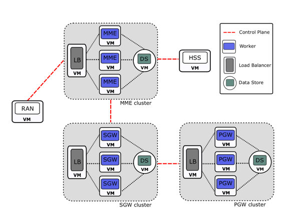

This is the scaling controller network, only contains the scaling module.

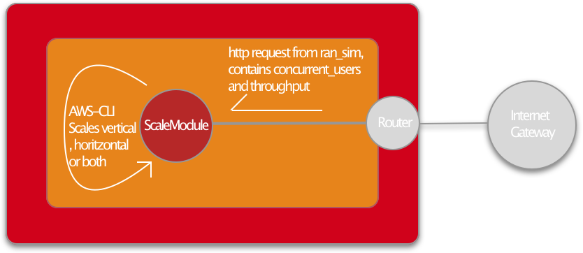
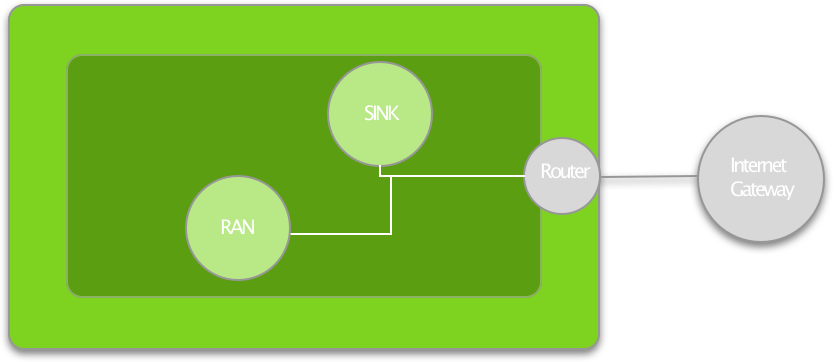

Each module has their own load balancer in nat mode and one DataStore instance, the mme network contains the HSS too.

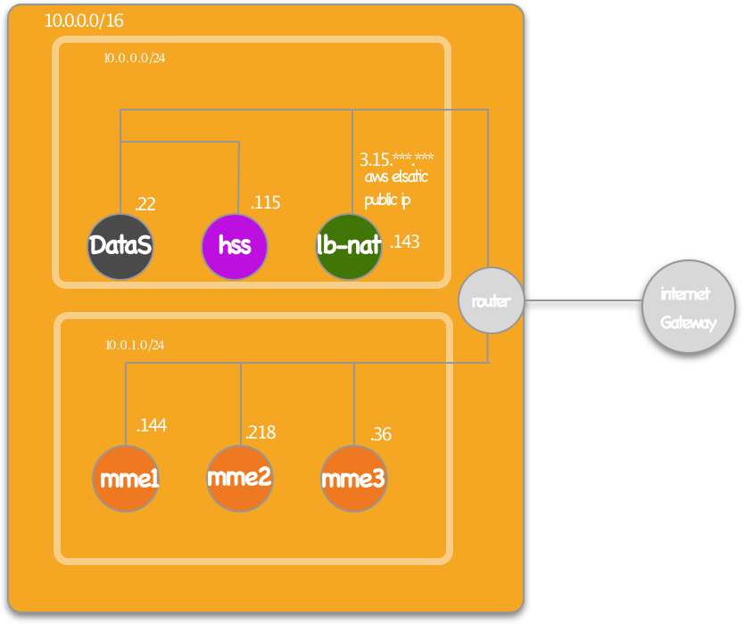
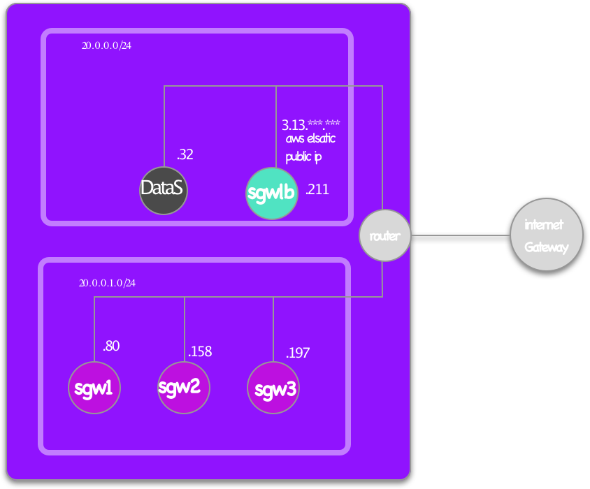
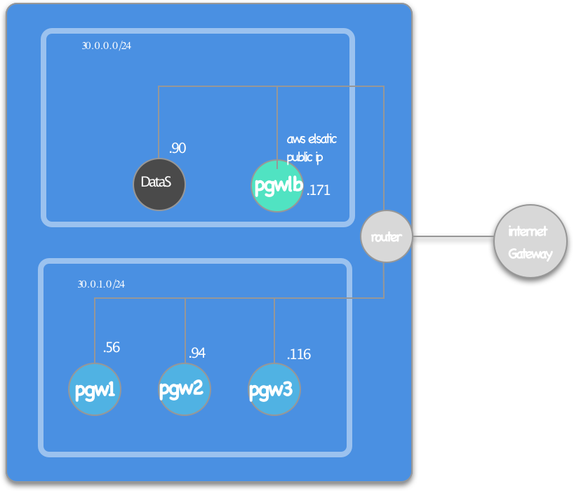

# Network Configuration.
We need to make three different VPC in order to operate in NAT mode in the load balancers, we are going to use the VPC-Wizard to automated the implementation of the VPC, manually we have to allow internet connectivity, and redirect the traffic from the private-subnet, where are hosted our VNF, to the internet passing through our LoadBalancer.

Amazon Wizard allow us to skip all these steps, they give us the VPC network already configured, in the particular case and for make all with ubuntu 14.04 we are going to replace the default virtual machine, Amazon Linux AMI, to an instance with ubuntu 14.04.

Go to VPC Wizard in first place and introduce the next configuration, we’re going to create the MME VPC network, it will be the 10.0.0.0/16 network with private subnet 10.0.1.0/24, in this network we are going to place the HSS too.

Make sure that you are using the instance-nat instead the nat gateway.

Once the AWS-WIZARD finished, go to the created instance and terminate it.

You have to create a new instance in the public subnet of the VPC, at the moment, the private instances can communicate between them 10.0.1.0/24 and with the instances at 10.0.0.0/16, conversely those vm can’t communicate with internet  nor ping google.com for example.

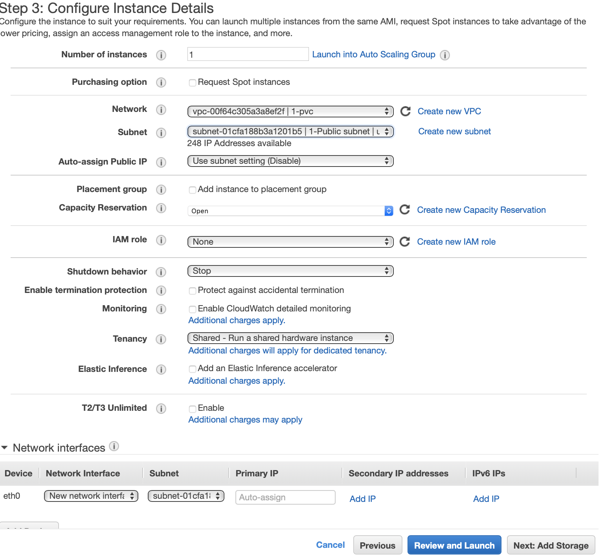

We are going to solve that putting the default output traffic of the 10.0.1.0/24 network, pass through our ubuntu14.04. to accomplish it, please go to VPC, Route Tables select the route with the Main field set at “yes”, select Edit  routes and add destination 0.0.0.0/0 and target set it with the nat-ubuntu-instance id.

![ ] (images/edit-route-instance.png)

When you are done, please go to subnet associations, edit subnet associations and select the private subnet 10.0.1.0/24, now create a new instance and make sure that you select our brand-new VPC network, and select the private Subnet of that network.
 

Check that your new instance have a proper 10.0.1.0/24 ip.

# NAT CONFIGURATION.

Now, we’re ready with the network, first we need to configure our Nat-Instances to ensure proper functionality fo the load balancer, please go to your EC2-dashboard, select the MME load balancer and deactivate the source/destination check, for do that, select the instance go to networking, Change source/dest Check, finally click in Yes, disable. 

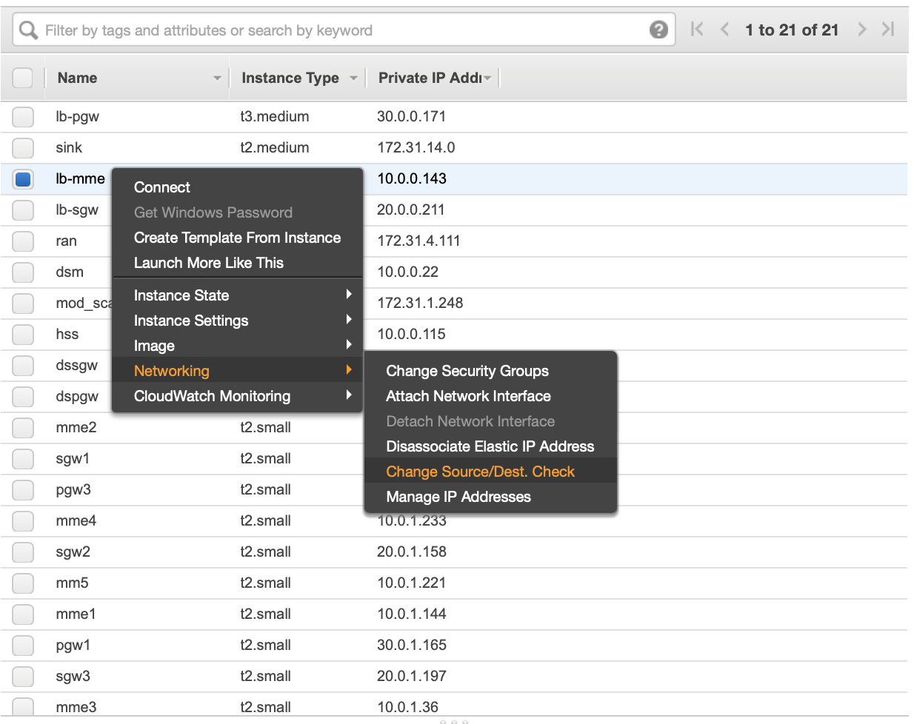

Connect to the instance with ssh, and install ipvsadm.

sudo apt install -y ipvsadm
sudo su 
sysctl -q -w net.ipv4.ip_forward=1 net.ipv4.conf.eth0.send_redirects=0

Now we are going to procedure with the ipvsadm config, for example if your load balancer instance is 10.0.0.43, and your  mme1 instance is 10.0.1.144, a valid config is: 

ipvsadm -A -t 10.0.0.143:5000 -s rr
ipvsadm -a -t 10.0.0.143:5000 -r 10.0.1.144:5000 -m 

That instruction sends all traffic  hitting  the load balancer 5000 port to the 10.0.1.144:5000 port, remember that your mme is listening for the 5000 port.

Now the network is set up to make your mme work, please, create another 2 instances in the private subnet and when your done add the rules to your LoadBalancer.

ipvsadm -a -t 10.0.0.143:5000 -r 10.0.1.218:5000 -m 
ipvsadm -a -t 10.0.0.143:5000 -r 10.0.1.36:5000 -m 

If you want to ensure a proper communication please do the following:

In the load balancer add a rule to allow communication with an Apache2 server:

ipvsadm -a -t 10.0.0.143:80 -r 10.0.1.36:80 -m 

In the mme1, in our case, 10.0.1.36, install an apache server:

sudo apt install -y apache2

Hit the public direction of the load balancer, in out case 3.15.xxx.xx:80, you can use your favorite browser, curl, wget…. You must see an Ubuntu server homepage.

Now go to your load balancer and see the stats of ipvsadm:

sudo su
Ipvsadm -l —stats

You must see a number different from 0 in all stats.
Repeat all this steps for each one of the VPCs and their respective load-balancer. If you allow me to advise you, draw in your blackboard all network with the internal and external ips for all the instances.  

These are our ipvsadm rules for the balancers.

Some valid config are:

SGW-LB
ipvsadm -A -u 20.0.0.211:7000 -s rr
ipvsadm -a -u 20.0.0.211:7000 -r 20.0.1.80:7000 -m 
ipvsadm -a -u 20.0.0.211:7000 -r 20.0.1.158:7000 -m 
ipvsadm -a -u 20.0.0.211:7000 -r 20.0.1.197:7000 -m 

ipvsadm -A -u 20.0.0.211:7100 -s rr
ipvsadm -a -u 20.0.0.211:7100 -r 20.0.1.80:7100 -m 
ipvsadm -a -u 20.0.0.211:7100 -r 20.0.1.158:7100 -m 
ipvsadm -a -u 20.0.0.211:7100 -r 20.0.1.197:7100 -m 

ipvsadm -A -u 20.0.0.211:7200 -s rr
ipvsadm -a -u 20.0.0.211:7200 -r 20.0.1.80:7200 -m 
ipvsadm -a -u 20.0.0.211:7200 -r 20.0.1.158:7200 -m 
ipvsadm -a -u 20.0.0.211:7200 -r 20.0.1.197:7200 -m 

PGW-LB

ipvsadm -A -u 30.0.0.171:8000 -s rr
ipvsadm -a -u 30.0.0.171:8000 -r 30.0.1.165:8000 -m 
ipvsadm -a -u 30.0.0.171:8000 -r 30.0.1.76:8000 -m 
ipvsadm -a -u 30.0.0.171:8000 -r 30.0.1.56:8000 -m 

ipvsadm -A -u 30.0.0.171:8100 -s rr
ipvsadm -a -u 30.0.0.171:8100 -r 30.0.1.165:8100 -m 
ipvsadm -a -u 30.0.0.171:8100 -r 30.0.1.76:8100 -m 
ipvsadm -a -u 30.0.0.171:8100 -r 30.0.1.56:8100 -m 

# Network Troubleshooting

For the PGW_LB and SGW_LB test you must use a udp client, so before you initialize the ./pgw 50 50, execute a udp server in the 8000 port. Hit the public address from your local machine to the PGW_LB, you must be able to establish a communication channel between the PGW and your local machine

Don’t forgot to change the ip to your machine ips, with this configuration you don’t need to config any virtual IP.
Execute from any VNF-Instance:
traceroute www.google.com

And look if your first hop is to the nat-instance 
Ensure that the network security is down for the ports that the system is using.

# VEPC configuration.

In first instance, please read the source-code  user manual that you can  found here: they explain with more details about every options, when you finish reading, update the utils.h file inside NFV_LTE_EPC/NFV_LTE_EPC-2.0/src with your network address.

Download a copy of this repo in each machine, execute the install_server.sh and install.sh in first place. Next cd to NFV_LTE_EPC/NFV_LTE_EPC-2.0/src edit the Makefile with the current vnf i.e, for the MME vnf: 

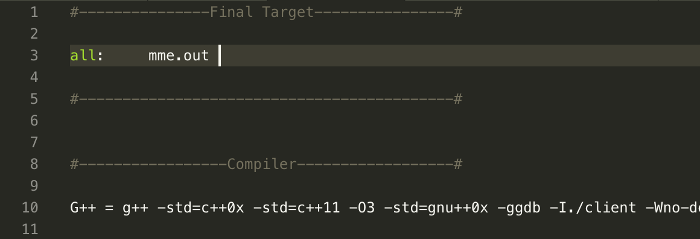

Warning! You MUST set the vnf-1 as the current vnf, ie: this is the utils.h for the MME2 with ip,  “10.0.1.218”, pay attention that the mme1 is set with  “10.0.1.218”:

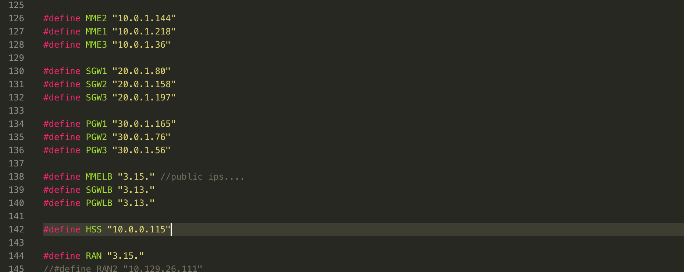

The utils.h of mm3 is: 

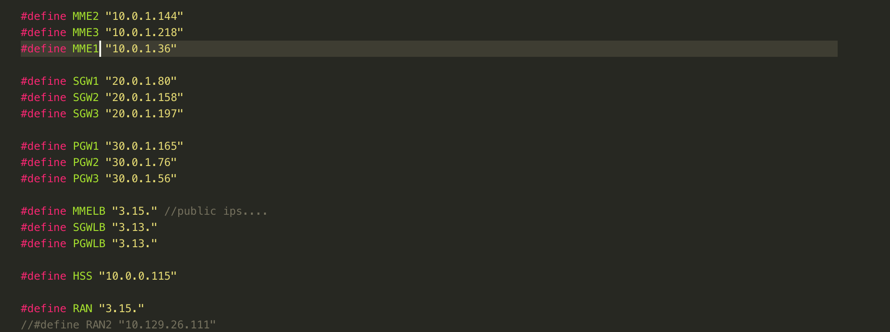

The same procedure is applied with PGW instances, but in the SGW instances you must delete 
the number of your current instance ie for the SGW2: 

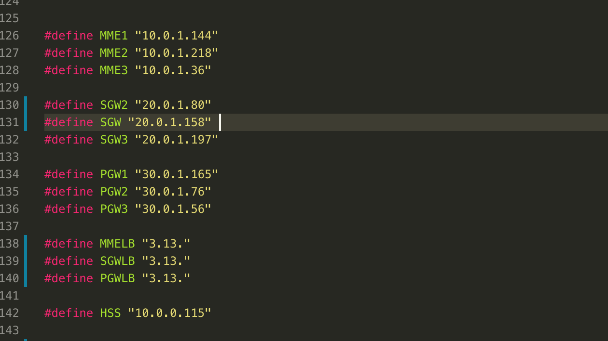

